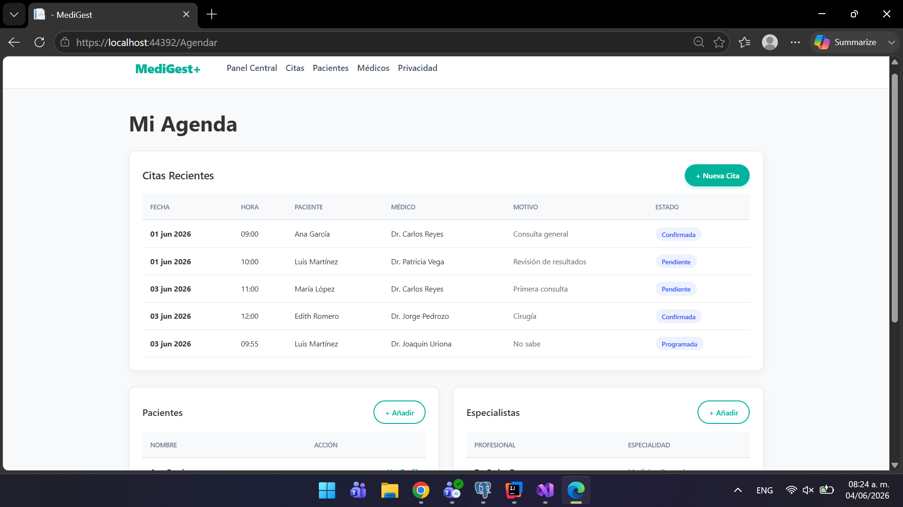
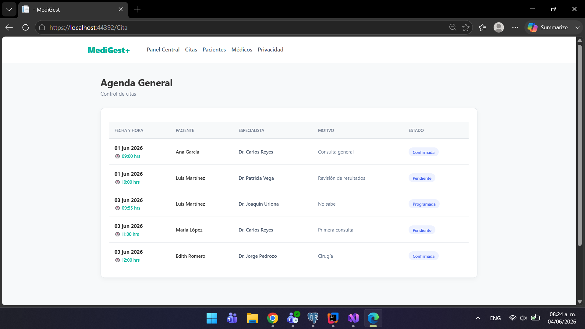
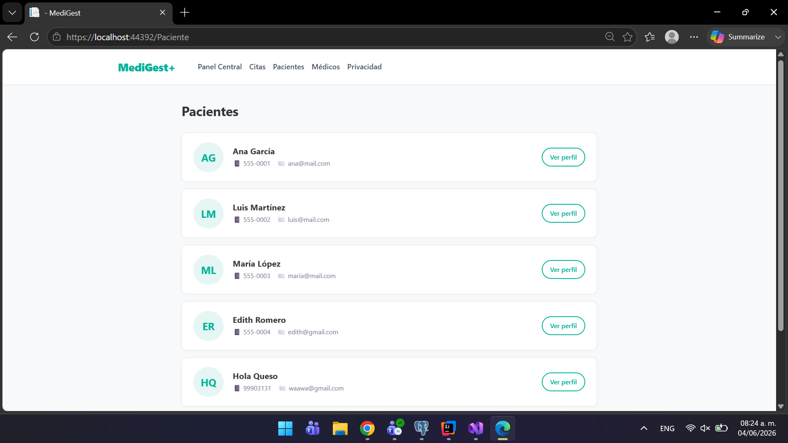

# 📘 Arquitectura de Software - Práctica 5

## 👨‍💻 Información del Estudiante

- **Nombre:** Joaquin Uriona
- **Matrícula:** SW2509057
- **Grupo:** A
- **Cuatrimestre:** Tercer Cuatrimestre
- **Carrera:** TSU en Desarrollo e Innovación de Software
- **Profesor:** Jorge Javier Pedrozo Romero
---

# App de citas médicas construida con ASP.NET Core MVC (.NET 10).
## Descripción del Proyecto

Este proyecto es un sistema integral de gestión clínica desarrollado en **ASP.NET Core MVC**, diseñado desde una perspectiva arquitectónica limpia que prescinde de bases de datos relacionales pesadas para implementar en su lugar una persistencia de datos rápida y portable basada en archivos JSON, donde el código destaca por la aplicación de **Principios SOLID** al separar estrictamente la lógica de acceso a datos mediante el **Patrón Repositorio** y utilizar la **Inyección de Dependencias** nativa del framework para acoplar las interfaces con sus implementaciones, garantizando así un código escalable y fácil de mantener, complementado con una interfaz de usuario moderna, responsiva y orientada a aplicaciones SaaS médicas

## Entidades
- **Paciente** — lista y detalle de pacientes registrados
- **Médico** — lista y detalle de médicos disponibles
- **Cita** — agenda completa y filtro por paciente

## Persistencia
Archivos JSON en `data/` — sin base de datos.
- `data/pacientes.json`
- `data/medicos.json`
- `data/citas.json`

## Arquitectura
Repositorios por interfaz con inyección de dependencias.
- `Interfaces/` — contratos (`IPacienteRepository`, `IMedicoRepository`, `ICitaRepository`)
- `Repositories/` — implementaciones JSON
- `Models/` — entidades + `CitaJson` como DTO de serialización

## Navegación
- `/Paciente` — lista de pacientes
- `/Medico` — lista de médicos
- `/Cita` — agenda completa

## 🛠️ Stack Tecnológico

**Backend & Framework**
- **C# / .NET 10:** Lenguaje y entorno de ejecución principal.
- **ASP.NET Core MVC:** Patrón arquitectónico para la separación estructurada de responsabilidades (Model-View-Controller).

**Patrones de Diseño**
- **Principios SOLID:** Código modular, altamente desacoplado y preparado para escalar.

**Frontend & UI**
- **Razor Views (`.cshtml`):** Motor de plantillas para la generación de vistas dinámicas enlazadas a los modelos de C#.
- **CSS3 / UI Personalizada:** Diseño de interfaz desde cero orientado a la experiencia de usuario (UX) de un SaaS corporativo.
- **Bootstrap 5:** Utilizado para la estructura del layout base y la barra de navegación responsiva.

---
## 📸 Capturas de Pantalla

  
  
<em>Panel de control principal (Home)</em>

  
  
<em>Vista unificada del sistema (Agendar)</em>

  
  
<em>Gestor centralizado de citas y horarios</em>

  
  
<em>Directorio humanizado y fichas clínicas</em>

  
  
<em>Documento de privacidad y seguridad de datos médicos</em>

---

## 🤝 Agradecimientos

- **Profesor Jorge Javier Pedrozo Romero** por la estructura del curso y la práctica
- **Tecnológico de Software** por la formación integral

---

## 📧 Contacto

- **Email Institucional:** joaquin.uriona@tecdesoftware.edu.mx
- **GitHub:** [Joako601](https://github.com/TU-USUARIO)

---

## 📄 Licencia

Este proyecto fue desarrollado por **Joaquin Uriona** como parte de las prácticas académicas para el **Tecnológico de Software**. 

Distribuido bajo la Licencia MIT. Siéntete libre de utilizar la arquitectura del código y el diseño de la interfaz para fines educativos o proyectos personales, siempre y cuando se mantenga el reconocimiento al autor original. 

Consulta el archivo `LICENSE` para más detalles.

---

## 🤖 Declaración de Uso de IA

Este proyecto integra asistencia de Inteligencia Artificial **exclusivamente para la correccion de la identacion y apartado frontend**

---

**⭐ Si te gustó este proyecto, dale una estrella ⭐**

Hecho con 💙 por Joaquin Uriona - 2026

