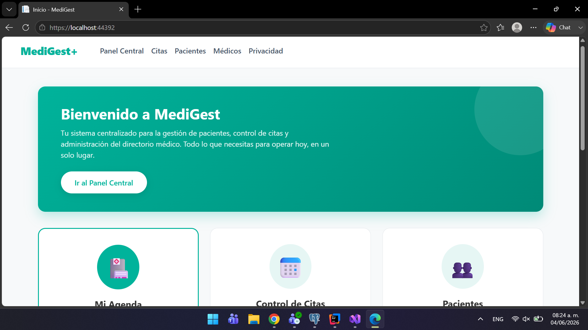
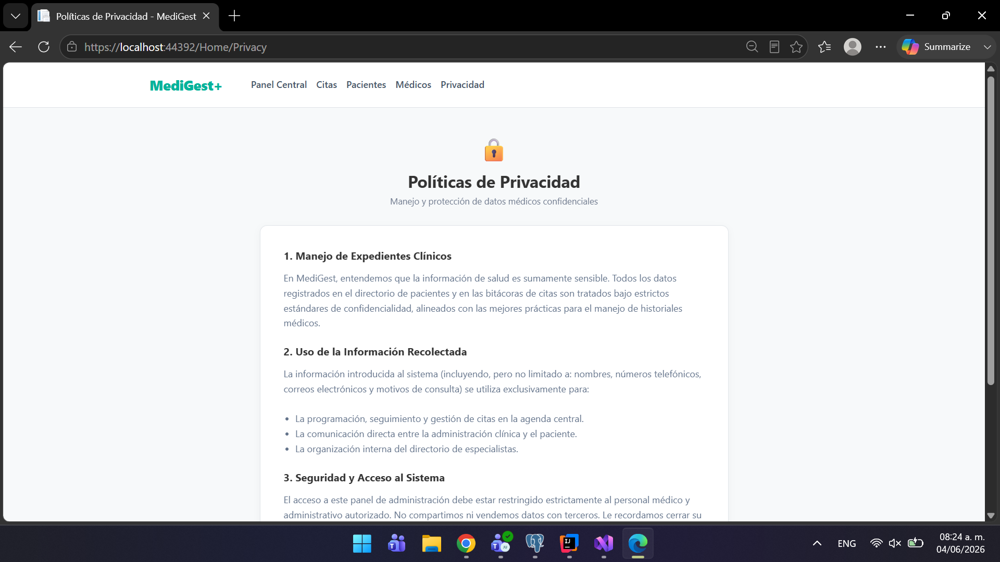

# 📘 Arquitectura de Software - Práctica 5

## 👨‍💻 Información del Estudiante

- **Nombre:** Joaquin Uriona
- **Matrícula:** SW2509057
- **Grupo:** A
- **Cuatrimestre:** Tercer Cuatrimestre
- **Carrera:** TSU en Desarrollo e Innovación de Software
- **Profesor:** Jorge Javier Pedrozo Romero
---


# App de citas médicas y API REST construida con ASP.NET Core (.NET 10)
## Descripción del Proyecto

Este proyecto es un sistema integral de gestión clínica desarrollado en **ASP.NET Core MVC**, estructurado bajo una arquitectura de hexagonal (Domain, Infrastructure, Web) que separa las responsabilidades del sistema, diseñado desde una perspectiva arquitectónica limpia que prescinde de bases de datos relacionales pesadas para implementar en su lugar una persistencia de datos rápida y portable basada en archivos JSON, donde el código destaca por la aplicación de **Principios SOLID** al separar estrictamente la lógica de acceso a datos mediante el **Patrón Repositorio** y utilizar la **Inyección de Dependencias** nativa del framework para acoplar las interfaces con sus implementaciones, garantizando así un código escalable y fácil de mantener, complementado con una interfaz de usuario moderna, responsiva y orientada a aplicaciones SaaS médicas, como una **API REST** para exponer los recursos del sistema, incluyendo utilidades adicionales como una calculadora.

## Entidades
- **Paciente** — lista y detalle de pacientes registrados
- **Médico** — lista y detalle de médicos disponibles
- **Cita** — agenda completa y filtro por paciente
- **Calculadora API** — Endpoint utilitario para realizar operaciones de busqueda de datos de la app principal aparte de realizar orperaciones matemáticas a través de la API.

## Persistencia
Archivos JSON en `data/` — sin base de datos.
- `data/pacientes.json`
- `data/medicos.json`
- `data/medicos.csv`
- `data/citas.json`

## Arquitectura
La solución está dividida en tres proyectos independientes:
```
Citas_App/
├── Citas_App.Domain/              # Contratos e entidades del negocio
│   ├── Interfaces/
│   │   ├── ICitaRepository.cs
│   │   ├── IMedicoRepository.cs
│   │   ├── IPacienteRepository.cs
│   │   └── ICitaObserver.cs       # Contrato del patrón Observer
│   └── Models/
│       ├── Cita.cs
│       ├── CitaJson.cs            # DTO de serialización JSON
│       ├── Medico.cs
│       ├── Paciente.cs
│       └── AgendarViewModel.cs
│
├── Citas_.Application/            # Casos de uso y lógica de aplicación
│   └── Services/
│       ├── CitaService.cs         # Subject del patrón Observer
│       ├── MedicoService.cs
│       └── PacienteService.cs
│
├── Citas_App.api/                 # Capa de presentación API RESTful
│   ├── Controllers/
│   │   ├── CalculadoraController.cs # Endpoint utilitario matemático
│   │   ├── CitaController.cs
│   │   ├── MedicoController.cs
│   │   └── PacienteController.cs
│   └── data/
│
├── Citas_App.Infrastructure/      # Implementaciones de repositorios JSON
│   ├── Repositories/
│   │   ├── JsonCitaRepository.cs
│   │   ├── JsonMedicoRepository.cs
│   │   ├── JsonPacienteRepository.cs
│   │   ├── CsvCitaRepository.cs
│   │   ├── CsvMedicoRepository.cs
│   │   ├── CsvPacienteRepository.cs
│   │   ├── SqliteCitaRepository.cs
│   │   ├── SqliteMedicoRepository.cs
│   │   ├── SqlitePacienteRepository.cs
│   │   ├── MemoriaPacienteRepository.cs
│   │   ├── LoggingPacienteRepository.cs # Decorator sobre IPacienteRepository
│   │   └── RepositoryFactory.cs   # Factory de repositorios
│   └── Observers/
│       ├── EmailObserver.cs       # Observer concreto
│       └── SmsObserver.cs         # Observer concreto
│
└── Citas_App.Web/                 # Capa de presentación (MVC Web)
    ├── Controllers/
    │   ├── AgendarController.cs
    │   ├── CitaController.cs
    │   ├── MedicoController.cs
    │   └── PacienteController.cs
    ├── Views/
    ├── wwwroot/
    ├── data/
    └── Program.cs
```

## Diagramas C4

Los diagramas de arquitectura del sistema están en:

[`docs/c4-arquitectura.md`](docs/c4-arquitectura.md)


## Navegación
- `/Pacientes` — lista de pacientes
- `/Medicoc` — lista de médicos
- `/Citas` — lista de citas
- `/Panel central` — panel central de administracion
- `/Privacidad` — privacidad de la pagina

## Endpoints Principales (API)
- `/api/Paciente` — Operaciones CRUD para pacientes
- `/api/Medico` — Operaciones CRUD para médicos
- `/api/Cita` — Gestión de la agenda médica
- `/api/Calculadora` — Operaciones matemáticas expuestas como servicio

## 🛠️ Stack Tecnológico

**Backend & Framework**
- **C# / .NET 10:** Lenguaje y entorno de ejecución principal.
- **ASP.NET Core MVC:** Patrón arquitectónico para la separación estructurada de responsabilidades (Model-View-Controller).
- ASP.NET Core Web API: Creación de servicios HTTP REST.

**Patrones de Diseño**
- **Principios SOLID:** Código modular, altamente desacoplado y preparado para escalar.
- **Hexagonal:**  Domain, Infrastructure, Web.

**Frontend & UI**
- **Razor Views (`.cshtml`):** Motor de plantillas para la generación de vistas dinámicas enlazadas a los modelos de C#.
- **CSS3 / UI Personalizada:** Diseño de interfaz desde cero orientado a la experiencia de usuario (UX) de un SaaS corporativo.
- **Bootstrap 5:** Utilizado para la estructura del layout base y la barra de navegación responsiva.

---

## Patrones GoF

+ Factory — RepositoryFactory (Citas_App.Infrastructure/Repositories/RepositoryFactory.cs) <br>
Centraliza la creación de los repositorios concretos según el entorno de ejecución (Production vs. desarrollo), devolviendo siempre la abstracción (IPacienteRepository, IMedicoRepository, ICitaRepository). Esto evita instanciar repositorios concretos con new desde Program.cs y permite cambiar la implementación de persistencia (JSON, SQLite, memoria, CSV) sin tocar el resto de la aplicación.
+ Decorator — LoggingPacienteRepository (Citas_App.Infrastructure/Repositories/LoggingPacienteRepository.cs) <br>
Envuelve cualquier IPacienteRepository (normalmente el que devuelve la Factory) y le añade un comportamiento de logging (timestamps, conteo de registros, resultado de la operación) sin modificar la implementación original ni el contrato. Se compone así: new LoggingPacienteRepository(RepositoryFactory.CrearPacienteRepository(...)), demostrando cómo Factory y Decorator se combinan en el mismo registro de dependencias (Program.cs). 
+ Observer — ICitaObserver (Citas_App.Domain/Interfaces/ICitaObserver.cs) + EmailObserver / SmsObserver (Citas_App.Infrastructure/Observers/) <br>
CitaService actúa como Subject: mantiene una lista de observadores (AgregarObserver) y, cuando una cita cambia a estado "Confirmada" (ConfirmarCita), notifica a todos los observadores registrados llamando a OnCitaConfirmada(cita). EmailObserver y SmsObserver son observadores concretos que reaccionan a esa notificación simulando el envío de una confirmación. Esto desacopla la lógica de negocio de las notificaciones: se pueden agregar nuevos canales (push, webhook, etc.) implementando ICitaObserver sin modificar CitaService.

---
## 📸 Capturas de Pantalla

<div align="center">
  
  <p><em>Panel de control principal (Home)</em></p>
</div>

<div align="center">
  
  <p><em>Vista unificada del sistema (Agendar)</em></p>
</div>

<div align="center">
  
  <p><em>Gestor centralizado de citas y horarios</em></p>
</div>

<div align="center">
  
  <p><em>Directorio humanizado y fichas clínicas</em></p>
</div>

<div align="center">
  
  <p><em>Documento de privacidad y seguridad de datos médicos</em></p>
</div>

---


## 🤝 Agradecimientos

- **Profesor Jorge Javier Pedrozo Romero** por la estructura del curso y la práctica
- **Tecnológico de Software** por la formación integral

---

## 📧 Contacto

- **Email Institucional:** joaquin.uriona@tecdesoftware.edu.mx
- **GitHub:** [Joako601](https://github.com/TU-USUARIO)

---

## 📄 Licencia

Este proyecto fue desarrollado por **Joaquin Uriona** como parte de las prácticas académicas para el **Tecnológico de Software**. 

Distribuido bajo la Licencia MIT. Siéntete libre de utilizar la arquitectura del código y el diseño de la interfaz para fines educativos o proyectos personales, siempre y cuando se mantenga el reconocimiento al autor original. 

Consulta el archivo `LICENSE` para más detalles.

---

## 🤖 Declaración de Uso de IA

Este proyecto integra asistencia de Inteligencia Artificial **exclusivamente para la correccion de la identacion y apartado frontend**

---

<div align="center">

**⭐ Si te gustó este proyecto, dale una estrella ⭐**

Hecho con 💙 por Joaquin Uriona - 2026

</div>
