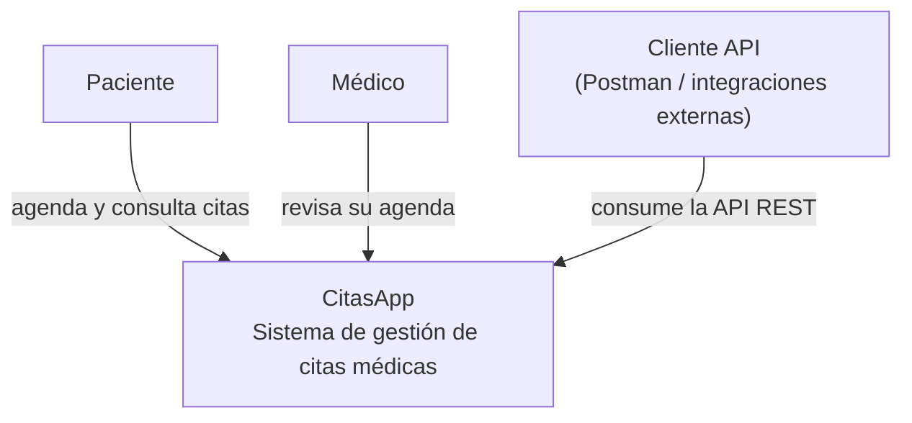
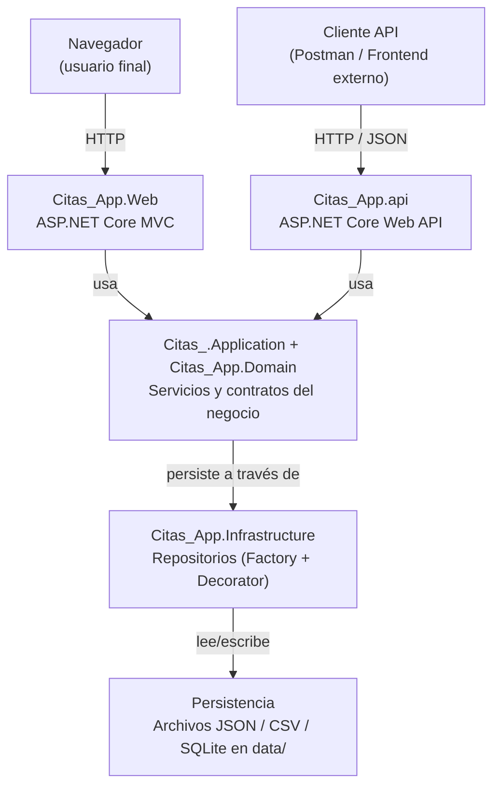
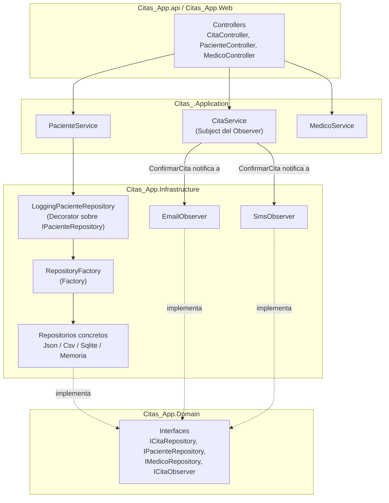

# Arquitectura C4 — CitasApp
---

## Nivel 1 — Contexto

**Para quién es:** cualquier persona (cliente, equipo no técnico, nuevo integrante).  
**Qué responde:** ¿qué es CitasApp y quién lo usa?

---

## Nivel 2 — Contenedores

**Para quién es:** el equipo técnico (desarrolladores, DevOps).  
**Qué responde:** ¿de qué piezas grandes y desplegables se compone CitasApp?

Los contenedores reales del repositorio:

| Contenedor | Proyecto | Responsabilidad |
|---|---|---|
| Web (MVC) | `Citas_App.Web` | Interfaz web para pacientes/médicos/admin |
| API REST | `Citas_App.api` | Expone `/api/Paciente`, `/api/Medico`, `/api/Cita`, `/api/Calculadora` |
| Núcleo de negocio | `Citas_.Application`, `Citas_App.Domain` | Servicios y contratos (interfaces) |
| Infraestructura | `Citas_App.Infrastructure` | Repositorios concretos, Factory, Decorator, Observers |
| Persistencia | `data/*.json`, `*.csv` | Sin base de datos relacional |

---

## Nivel 3 — Componentes

**Para quién es:** quien va a modificar o extender el backend.  
**Qué responde:** ¿qué hay dentro de la API/Web y cómo se aplican los patrones GoF?

### Patrones GoF representados

- **Factory** — `RepositoryFactory` (`Citas_App.Infrastructure/Repositories/RepositoryFactory.cs`) decide qué repositorio concreto instanciar (JSON, SQLite, memoria) según el entorno, devolviendo siempre la interfaz del `Domain`.
- **Decorator** — `LoggingPacienteRepository` envuelve a `IPacienteRepository` (normalmente el que devuelve la Factory) y añade logging sin tocar la implementación original.
- **Observer** — `CitaService` actúa como *Subject*: cuando una cita se confirma (`ConfirmarCita`), notifica a los observadores registrados (`EmailObserver`, `SmsObserver`) que implementan `ICitaObserver`.
